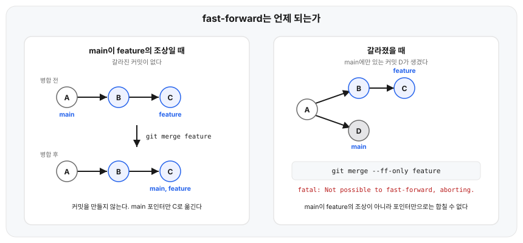
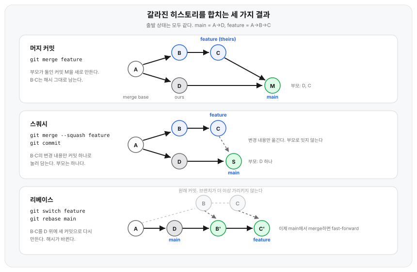

## 왜 필요한가

`git merge feature`를 두 번 실행해도 히스토리 모양이 다르게 남는다. 어제는 커밋이 하나도 늘지 않았는데 오늘은 `Merge branch 'feature'` 커밋이 생긴다. 팀에서 `--no-ff`를 쓰라고 했는데 왜 쓰는지는 설명이 없고, `--ff-only`를 걸어 두면 어떤 날은 `fatal: Not possible to fast-forward, aborting.`로 막힌다.

옵션 이름만 외우면 이 상황을 예측할 수 없다. `merge`가 무엇을 보고 어떤 커밋을 만드는지 알면 세 가지 결과가 언제 나오는지가 정해진다.

## 용어 정리

| 용어 | 뜻 |
|---|---|
| merge base | 두 브랜치가 갈라진 지점의 공통 조상 커밋. `git merge-base <A> <B>`로 확인한다 |
| fast-forward | 브랜치 포인터만 앞으로 옮기는 병합. 커밋을 만들지 않는다 |
| 머지 커밋(merge commit) | 부모를 둘 이상 가진 커밋. `git log`의 `%p`에 부모가 여러 개 찍힌다 |
| 3-way 병합 | merge base, 현재 브랜치, 상대 브랜치 세 지점을 비교해 결과를 만드는 방식 |
| ours / theirs | 병합할 때 현재 브랜치가 ours, 인자로 준 브랜치가 theirs다. 리베이스 중에는 뒤집혀서 리베이스의 기준이 되는 쪽이 ours가 된다 |
| 전략(strategy) | 여러 갈래를 어떤 알고리즘으로 합칠지. `-s`로 고른다 |
| 전략 옵션 | 고른 전략의 세부 동작. `-X`로 준다. `-s`와 다른 것이다 |

## 핵심 정리

히스토리 모양을 정하는 옵션이다.

| 명령 | 하는 일 | 남는 커밋 |
|---|---|---|
| `git merge <브랜치>` | 현재 브랜치가 상대 브랜치의 조상이면 fast-forward, 아니면 머지 커밋 | 상황에 따라 0개 또는 1개 |
| `git merge --no-ff <브랜치>` | 조상 관계여도 머지 커밋을 만든다 | 부모 2개짜리 머지 커밋 |
| `git merge --ff-only <브랜치>` | fast-forward가 안 되면 거부하고 종료 | 0개 또는 병합 실패 |
| `git merge --squash <브랜치>` | 병합 결과를 작업 트리와 인덱스에만 올린다. 커밋은 직접 한다 | 부모 1개짜리 일반 커밋 |
| `git merge <A> <B> ...` | 브랜치 여럿을 한 번에 병합(octopus) | 부모 3개 이상인 머지 커밋 |

내용을 어떻게 합칠지 정하는 전략과 전략 옵션이다.

| 옵션 | 하는 일 | 상대 브랜치의 변경 |
|---|---|---|
| `-s ort` | 기본 전략. 3-way 병합으로 양쪽 변경을 합친다 | 전부 반영. 겹치면 충돌 |
| `-X ours` | ort를 쓰되 충돌한 부분만 현재 브랜치 값으로 결정 | 충돌하지 않은 변경은 반영 |
| `-X theirs` | 충돌한 부분만 상대 브랜치 값으로 결정 | 충돌하지 않은 변경은 반영 |
| `-s ours` | 상대 트리를 아예 보지 않는다. 결과 트리는 현재 브랜치 그대로 | 하나도 반영하지 않음 |
| `-s subtree` | 한쪽 트리를 다른 쪽 하위 디렉터리에 대응시켜 병합 | 대응시킨 경로 기준으로 반영 |

`-s ort`는 Git 2.34부터 기본값이다. 릴리스 노트는 [`ort` 전략이 `recursive` 대신 기본 병합 전략으로 쓰인다](https://github.com/git/git/blob/v2.34.0/Documentation/RelNotes/2.34.0.txt)고 적었다. 그 전 버전에서는 `recursive`가 같은 자리를 맡았고 결과도 대체로 같다.

## 항목별 설명

### fast-forward는 조상 관계일 때만 된다

기준은 옵션이 아니라 커밋 그래프다. 현재 브랜치가 병합할 브랜치의 조상이면, 즉 갈라진 뒤 현재 브랜치에 새 커밋이 하나도 없으면 포인터만 옮겨도 두 히스토리가 합쳐진다. [공식 문서](https://git-scm.com/docs/git-merge#_fast_forward_merge)는 이 경우를 이렇게 설명한다.

> In this case, a new commit is not needed to store the combined history; instead, the `HEAD` (along with the index) is updated to point at the named commit, without creating an extra merge commit.

갈라진 뒤 현재 브랜치에도 커밋이 생겼다면 포인터를 옮기는 것만으로는 그 커밋을 담을 수 없다. 그래서 `--ff-only`가 거부한다.



`--no-ff`는 이 조건과 무관하게 항상 머지 커밋을 만든다. 브랜치 하나가 어디서 갈라져 어디서 합쳐졌는지가 그래프에 남으므로, 기능 단위를 되돌리거나 리뷰 범위를 찾을 때 기준점이 된다. 대신 커밋이 하나 더 늘고 그래프가 갈라진다.

`--ff`·`--no-ff`·`--ff-only` 중 무엇이 기본값인지는 `merge.ff` 설정이 정한다. `false`면 `--no-ff`, `only`면 `--ff-only`가 기본이 된다.

### 갈라진 뒤에는 3-way 병합이 필요하다

merge base가 A이고 main에 D, feature에 B·C가 있는 상태에서 무엇을 실행하느냐에 따라 결과가 갈린다.



머지 커밋은 A·D·C 세 지점을 비교해 만든다. A와 D의 차이가 main이 한 변경이고, A와 C의 차이가 feature가 한 변경이다. 둘이 같은 줄을 건드리지 않았으면 양쪽 변경을 그대로 합치고, 겹치면 충돌로 남긴다. merge base를 기준으로 삼기 때문에 "양쪽 파일이 다르다"가 아니라 "양쪽이 같은 곳을 서로 다르게 바꿨다"만 충돌이 된다.

스쿼시와 리베이스는 같은 출발 상태에서 다른 결과를 만든다. 뒤에서 다룬다.

### 스쿼시는 이력이 아니라 내용만 옮긴다

`--squash`는 병합 결과를 작업 트리와 인덱스에 올려놓고 멈춘다. [공식 문서](https://git-scm.com/docs/git-merge#Documentation/git-merge.txt---squash)의 설명이다.

> Produce the working tree and index state as if a real merge happened (except for the merge information), but do not actually make a commit, move the `HEAD`, or record `$GIT_DIR/MERGE_HEAD`

`MERGE_HEAD`를 남기지 않는 것이 핵심이다. 그래서 이어서 실행하는 `git commit`은 머지 커밋이 아니라 부모가 하나인 일반 커밋이 된다. 커밋 메시지 초안은 `.git/SQUASH_MSG`에 병합한 커밋 목록으로 들어간다.

기능 브랜치의 중간 커밋 수십 개를 main에 남기지 않고 결과만 커밋 하나로 올릴 때 쓴다. 대가는 연결이 끊긴다는 점이다. main 쪽에는 B·C의 내용은 있지만 B·C를 조상으로 기록한 커밋이 없다.

### `-s ours`와 `-X ours`는 다른 것이다

`-X ours`는 ort 전략을 그대로 쓰면서 충돌한 부분만 현재 브랜치 값으로 결정한다. 충돌하지 않은 상대 변경은 전부 들어온다. `-s ours`는 상대 트리를 읽지도 않는다. [공식 문서](https://git-scm.com/docs/merge-strategies#Documentation/merge-strategies.txt-ours)가 직접 구분해 둔 지점이다.

> This should not be confused with the `ours` merge strategy, which does not even look at what the other tree contains at all. It discards everything the other tree did, declaring _our_ history contains all that happened in it.

`-s ours`는 결과 트리가 현재 브랜치 그대로인데도 머지 커밋은 만든다. 상대 브랜치를 "합친 것으로 기록만" 하는 셈이라, 더 쓰지 않을 옛 브랜치를 정리하면서 이후 병합에서 다시 딸려 오지 않게 할 때 쓴다.

### octopus는 브랜치 여럿을 한 번에 받는다

인자를 둘 이상 주면 전략이 octopus로 바뀌고, 부모가 셋 이상인 머지 커밋이 생긴다. 대신 사람이 손으로 풀어야 하는 충돌이 있으면 병합 자체가 실패한다.

### `-s subtree`는 트리 위치를 맞춘 뒤 비교한다

다른 저장소의 히스토리를 하위 디렉터리로 끌어올 때 쓴다. 양쪽 트리의 루트가 어긋나 있어도 한쪽을 다른 쪽의 하위 경로에 대응시켜 놓고 병합한다.

## 예시

`--ff-only`는 갈라진 상태에서 아무것도 하지 않고 종료한다.

```
$ git log --oneline --graph --all --decorate
* 60a0a6e (HEAD -> main) D: 핫픽스
| * 1d5a13d (feature) C: 기능 2
| * 048edd4 B: 기능 1
|/
* 5b8fc26 A: 초기 커밋

$ git merge --ff-only feature
fatal: Not possible to fast-forward, aborting.
```

옵션 없이 실행하면 부모가 둘인 머지 커밋이 생긴다.

```
$ git merge feature -m "Merge branch 'feature'"
Merge made by the 'ort' strategy.
 app.txt | 2 ++
 1 file changed, 2 insertions(+)

$ git log -1 --pretty='%h %p %s'
e87429c 60a0a6e 1d5a13d Merge branch 'feature'
```

`%p`에 `60a0a6e`(main의 D)와 `1d5a13d`(feature의 C)가 함께 찍혔다. 이 머지 커밋을 되돌려 같은 출발 상태로 돌아간 뒤 `--squash`로 병합하면 부모가 하나만 남는다.

```
$ git reset --hard 60a0a6e
HEAD is now at 60a0a6e D: 핫픽스

$ git merge --squash feature
Squash commit -- not updating HEAD
Automatic merge went well; stopped before committing as requested

$ git status -s
M  app.txt

$ git commit -m "feature 병합 (squash)"
[main 08c69ba] feature 병합 (squash)
 1 file changed, 2 insertions(+)

$ git log -1 --pretty='parents=%p'
parents=60a0a6e
```

## 직접 확인

`-s ours`와 `-X ours`의 차이는 파일 목록으로 드러난다. 앞 절과는 별개로 만든 저장소다. feature가 `config.txt`의 같은 줄을 `version=3`으로 바꾸고 `extra.txt`를 새로 추가했고, main은 같은 줄을 `version=2`로 바꾼 상태다.

```
$ git merge -X ours feature -m "merge -X ours"
Auto-merging config.txt
Merge made by the 'ort' strategy.
 extra.txt | 1 +
 1 file changed, 1 insertion(+)
 create mode 100644 extra.txt

$ cat config.txt
version=2
name=app

$ ls
config.txt  extra.txt
```

충돌한 줄은 main 값인 `version=2`로 남았지만, 충돌하지 않은 `extra.txt`는 들어왔다. 이 병합을 되돌려 같은 출발 상태로 돌아간 뒤 `-s ours`로 병합하면 `extra.txt`가 없다.

```
$ git reset --hard HEAD~1
HEAD is now at e0d52cf B: version 2

$ git merge -s ours feature -m "merge -s ours"
Merge made by the 'ours' strategy.

$ cat config.txt
version=2
name=app

$ ls
config.txt

$ git diff HEAD^1 HEAD --stat
```

마지막 `git diff`가 아무것도 출력하지 않는다. 머지 커밋의 트리가 첫 번째 부모와 완전히 같다는 뜻이다.

## 혼동하기 쉬운 것

**`--squash`로 병합한 브랜치를 다시 병합하면 충돌하기 쉽다.** 스쿼시는 이력을 잇지 않으므로 merge base가 갈라진 지점 A에 그대로 머문다. feature에 커밋 E를 하나 더 얹고 다시 병합하면, Git은 A를 기준으로 B·C·E를 전부 새 변경으로 보고 적용하려 든다. main에 이미 B·C의 내용이 있어도 이력에 기록이 없어 Git이 그 사실을 알 방법이 없다. 그래서 양쪽이 파일 같은 자리에 줄을 덧붙인 것으로 보고 그 자리를 충돌 후보로 잡는다.

```
$ git merge feature -m "Merge branch 'feature' again"
Auto-merging app.txt
CONFLICT (content): Merge conflict in app.txt
Automatic merge failed; fix conflicts and then commit the result.

$ cat app.txt
main
feature 1
feature 2
<<<<<<< HEAD
=======
feature 3
>>>>>>> feature
```

양쪽이 똑같이 덧붙인 `feature 1`·`feature 2`는 맞춰졌고, 그 뒤에 이어 붙은 `feature 3`만 충돌 표시로 남았다. 스쿼시로 받은 브랜치는 병합 후 지우고 새로 만드는 편이 안전하다.

**`--squash`는 `--commit`이나 `--no-ff`와 함께 쓸 수 없다.** 커밋을 만들지 않는 것이 `--squash`의 동작이라 애초에 양립하지 않는다.

```
$ git merge --squash --no-ff feature
fatal: options '--squash' and '--no-ff.' cannot be used together
```

**리베이스는 커밋을 옮기지 않고 새로 만든다.** 「예시」 절 첫 상태(main은 D, feature는 C)로 돌아가, feature에서 `git rebase main`을 실행하면 B·C의 변경 내용이 D 위에서 다시 적용되면서 부모가 바뀌고, 부모가 바뀌면 해시도 바뀐다.

```
$ git switch feature
Switched to branch 'feature'

$ git log --oneline -2
1d5a13d C: 기능 2
048edd4 B: 기능 1

$ git rebase main
Successfully rebased and updated refs/heads/feature.

$ git log --oneline -3
3913251 C: 기능 2
92dacd3 B: 기능 1
60a0a6e D: 핫픽스
```

커밋 메시지는 그대로인데 `048edd4`와 `1d5a13d`가 `92dacd3`과 `3913251`이 됐다. 이미 push한 브랜치를 리베이스하면 남들이 받아 간 커밋과 해시가 달라지므로, 공유 브랜치에는 쓰지 않는다.

**애노테이트 태그를 병합할 때는 `--no-ff`가 기본이다.** `refs/tags/` 아래 제자리에 있지 않은 애노테이트 태그를 병합하면 fast-forward가 가능해도 머지 커밋이 생긴다. [문서에 명시된 예외](https://git-scm.com/docs/git-merge#Documentation/git-merge.txt---no-ff)다.

## 언제 어떤 것을 쓰나

| 상황 | 선택 |
|---|---|
| 기능 브랜치의 시작과 끝을 히스토리에 남기고 싶다 | `--no-ff` |
| main을 한 줄로 유지하고 머지 커밋을 만들고 싶지 않다 | `--ff-only` + 병합 전 리베이스 |
| 중간 커밋을 main에 남기지 않고 결과만 올린다 | `--squash` |
| 브랜치를 정리하되 이후 병합에서 다시 딸려 오지 않게 한다 | `-s ours` |
| 설정 파일처럼 한쪽 값을 항상 우선하는 파일이 있다 | `-X ours` 또는 `-X theirs` |

리베이스와 체리픽은 merge 명령이 아니지만 같은 자리에서 후보로 오른다. 리베이스는 브랜치의 커밋 전부를 다른 지점 위에 다시 만들어 히스토리를 한 줄로 정리할 때, 체리픽은 브랜치에서 커밋 하나만 골라 가져올 때 쓴다. 둘 다 새 커밋을 만들므로 이미 공유된 커밋에는 적용하지 않는다.

각자 `git config --global merge.ff only`를 걸어 두면 갈라진 상태에서 실수로 머지 커밋이 생기는 일이 없고, 병합 전에 리베이스하거나 명시적으로 `--no-ff`를 붙이게 된다. 이 설정은 `git pull`에도 걸린다. pull은 내부에서 병합을 하기 때문이다. pull만 다르게 두려면 [`pull.ff`](https://git-scm.com/docs/git-config#Documentation/git-config.txt-pullff)를 따로 준다. 문서는 `This setting overrides merge.ff when pulling.`이라고 적었다.

다만 개인 머신 설정이라 팀 전체에 강제되지 않는다. 강제하려면 원격 저장소 쪽 브랜치 보호 규칙이 필요하다.

## 참고

- [git-merge 공식 문서](https://git-scm.com/docs/git-merge)
- [merge-strategies 공식 문서](https://git-scm.com/docs/merge-strategies)
- [git-rebase 공식 문서](https://git-scm.com/docs/git-rebase)
- [Git 2.34 릴리스 노트](https://github.com/git/git/blob/v2.34.0/Documentation/RelNotes/2.34.0.txt)
