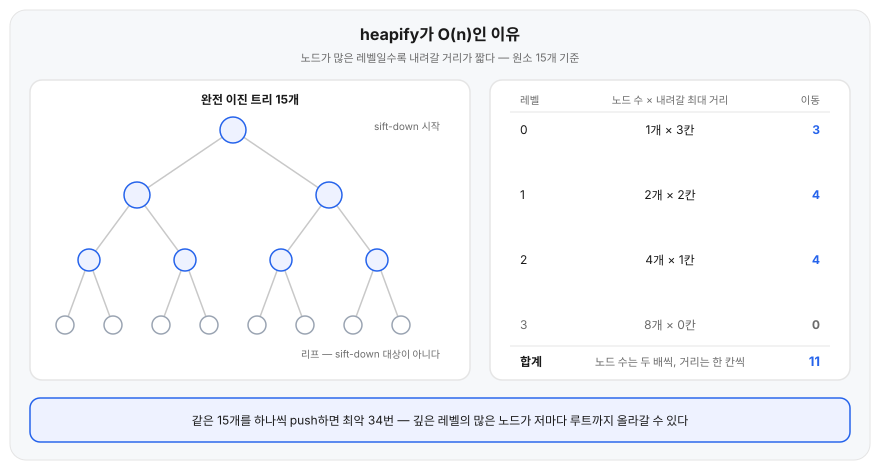

## 왜 필요한가

정렬된 배열에서 최솟값을 반복해 꺼내면, 꺼내는 연산 자체는 O(1)이다. 대신 새 값이 들어올 때마다 정렬 상태를 유지하려면 넣을 자리를 찾아 옮기는 데 O(n)이 든다.

힙은 정렬 상태를 포기하는 대신 삽입과 삭제를 모두 O(log n)에 처리한다. 우선순위 큐, 상위 K개 찾기, 다익스트라처럼 "최솟값(또는 최댓값)을 계속 꺼내야 하는" 문제에서 쓰는 이유다.

## 용어 정리

- **완전 이진 트리(complete binary tree)**: 마지막 레벨을 제외한 모든 레벨이 꽉 차 있고, 마지막 레벨은 왼쪽부터 채워진 트리. 힙을 배열 하나로 표현할 수 있는 이유다.
- **힙 속성(heap property)**: 모든 노드가 자식보다 작거나(min-heap) 크다(max-heap)는 규칙. 부모-자식 관계만 정하고, 형제끼리의 순서는 정하지 않는다.
- **min-heap / max-heap**: 루트가 최솟값인지 최댓값인지에 따른 구분. 아래 설명은 min-heap 기준이다.

## 핵심 정리

| 연산 | 하는 일 | 시간복잡도 |
|---|---|---|
| push (삽입) | 배열 끝에 넣고 sift-up으로 힙 속성을 복구한다 | O(log n) |
| pop (최솟값 꺼내기) | 루트를 꺼내고 마지막 원소를 루트로 옮긴 뒤 sift-down한다 | O(log n) |
| peek (최솟값 보기) | 루트 값을 읽기만 한다 | O(1) |
| heapify (배열 전체를 힙으로 만들기) | 마지막 비-리프 노드부터 거꾸로 sift-down한다 | O(n) |

## 항목별 설명

**배열로 표현하기.** 힙은 트리지만 포인터로 노드를 연결하지 않고 배열 하나로 표현한다. 완전 이진 트리라 빈 칸이 생기지 않기 때문이다. 0-indexed 기준으로 인덱스 `i`의 자식은 `2i+1`, `2i+2`이고 부모는 `(i-1)//2`다.

**삽입 — sift-up.** 새 값을 배열 끝에 붙인다. 이 위치는 힙 속성을 깰 수 있으므로 부모와 비교해 더 작으면 교환하고, 옮긴 자리에서 다시 부모와 비교하는 과정을 반복한다. 트리 높이만큼, 즉 O(log n)번 비교하면 끝난다.

**삭제 — sift-down.** 루트를 꺼낸 자리는 비워둘 수 없으므로 배열의 마지막 원소를 루트로 옮긴다. 이 값은 대개 힙 속성을 깨므로, 두 자식 중 더 작은 쪽과 비교해 교환하는 과정을 자식이 없거나 순서가 맞을 때까지 반복한다.

**heapify가 O(n)인 이유.** 정렬 안 된 배열 n개를 힙으로 만들 때 원소를 하나씩 push하면 O(n log n)이 든다. 대신 배열은 그대로 두고 마지막 비-리프 노드부터 거꾸로 sift-down하면 O(n)에 끝난다. 가장 불리한 입력으로 보면 왜 그런지 드러난다.

min-heap에 최악인 배열은 완전 역순 `[7, 6, 5, 4, 3, 2, 1]`이다. 최솟값이 맨 끝에 있고 모든 부모가 자식보다 커서, 손대는 노드마다 갈 수 있는 데까지 끝까지 내려간다. 인덱스 3·4·5·6은 리프라 애초에 대상이 아니고, 남은 2·1·0을 거꾸로 훑는다.

| 처리 노드 | 하는 일 | 배열 상태 |
|---|---|---|
| 시작 전 | | `[7, 6, 5, 4, 3, 2, 1]` |
| `i=2` (값 5) | 자식 2, 1 중 더 작은 1과 교환. 한 칸 내려가 리프에 닿는다 | `[7, 6, 1, 4, 3, 2, 5]` |
| `i=1` (값 6) | 자식 4, 3 중 더 작은 3과 교환. 한 칸 내려가 리프에 닿는다 | `[7, 3, 1, 4, 6, 2, 5]` |
| `i=0` (값 7) | 1과 교환한 뒤 그 자리에서 다시 2와 교환. 두 칸 내려간다 | `[1, 3, 2, 4, 6, 7, 5]` |

전부 최대로 내려갔는데도 이동은 4번이다. 7개짜리 순열 5040가지를 전부 돌려도 이 값이 최대다. 노드 하나가 log n칸씩 내려가서가 아니라, **내려갈 자리가 있는 노드 자체가 적기** 때문이다. 7개 중 4개는 리프라 0칸이고, 두 칸을 내려갈 수 있는 노드는 루트 하나뿐이다. 레벨별로 세면 `1×2 + 2×1 + 4×0 = 4`가 그대로 나온다.

같은 배열을 push로 하나씩 넣으면 10번이다. 역순이라 들어오는 값마다 새 최솟값이어서 배열 끝에서 루트까지 거슬러 올라간다. 뒤에 들어오는 원소일수록 출발 자리가 깊고, 그런 원소가 절반을 넘는다.

n이 커져도 이 비율은 그대로다. 리프에 가까운 노드일수록 개수는 많지만 내려갈 높이는 짧아서, 레벨마다 `노드 수 × 내려갈 최대 거리`를 더해도 합이 n을 넘지 않는다.

```text
h = ⌊log₂ n⌋,  레벨 k의 노드 수 = 2^k,  내려갈 최대 거리 = h − k

T(n) = Σ[k=0..h] 2^k (h − k)
     = Σ[j=0..h] 2^(h−j) · j        (j = h − k, k = h − j)
     = Σ[j=0..h] 2^h · j / 2^j      (2^(h−j) = 2^h / 2^j)
     = 2^h · Σ[j=0..h] j / 2^j      (2^h는 j와 무관)
     < 2^h · 2                      (Σ[j=0..∞] j / 2^j = 2)
     ≤ 2n                           (2^h ≤ n)

완전 이진 트리(n = 2^(h+1) − 1)에서는 T(n) = 2^(h+1) − h − 2 = n − h − 1
```



## 예시

배열 기반 min-heap을 직접 구현하면 다음과 같다.

```python
class MinHeap:
    def __init__(self):
        self.data = []

    def push(self, value):
        self.data.append(value)
        self._sift_up(len(self.data) - 1)

    def pop(self):
        top = self.data[0]
        last = self.data.pop()
        if self.data:
            self.data[0] = last
            self._sift_down(0)
        return top

    def heapify(self, values):
        self.data = list(values)
        for i in range(len(self.data) // 2 - 1, -1, -1):
            self._sift_down(i)

    def _sift_up(self, i):
        while i > 0:
            parent = (i - 1) // 2
            if self.data[i] < self.data[parent]:
                self.data[i], self.data[parent] = self.data[parent], self.data[i]
                i = parent
            else:
                break

    def _sift_down(self, i):
        n = len(self.data)
        while True:
            left, right = 2 * i + 1, 2 * i + 2
            smallest = i
            if left < n and self.data[left] < self.data[smallest]:
                smallest = left
            if right < n and self.data[right] < self.data[smallest]:
                smallest = right
            if smallest == i:
                break
            self.data[i], self.data[smallest] = self.data[smallest], self.data[i]
            i = smallest
```

`push(5, 3, 8, 1, 4)`를 순서대로 호출하면 배열은 이렇게 바뀐다.

| 호출 | 배열 상태 |
|---|---|
| `push(5)` | `[5]` |
| `push(3)` | `[3, 5]` |
| `push(8)` | `[3, 5, 8]` |
| `push(1)` | `[1, 3, 8, 5]` |
| `push(4)` | `[1, 3, 8, 5, 4]` |

`push(1)`에서 `[3, 5, 8, 1]`이 된 직후, 1은 부모 5보다 작아 교환되고(`[3, 1, 8, 5]`), 다시 부모 3보다 작아 한 번 더 교환된다(`[1, 3, 8, 5]`). sift-up이 두 단계를 거슬러 올라간 경우다.

이어서 `pop()`을 다섯 번 호출하면 최솟값부터 순서대로 나온다.

| 호출 | 반환값 | 남은 배열 |
|---|---|---|
| `pop()` | `1` | `[3, 4, 8, 5]` |
| `pop()` | `3` | `[4, 5, 8]` |
| `pop()` | `4` | `[5, 8]` |
| `pop()` | `5` | `[8]` |
| `pop()` | `8` | `[]` |

첫 `pop()`에서 마지막 원소 4가 루트로 올라가 `[4, 3, 8, 5]`가 된 뒤, 두 자식(3, 8) 중 더 작은 3과 교환돼 `[3, 4, 8, 5]`로 정리된다.

위 `heapify` 메서드가 도는 순서와 배열 상태는 앞 「항목별 설명」의 표와 같다.

**상위 K개 찾기.** 힙이 실제로 쓰이는 자리다. n개에서 가장 큰 k개만 필요할 때 전부 정렬하면 O(n log n)이지만, 크기 k짜리 min-heap을 유지하면 O(n log k)로 끝난다. 루트가 후보 k개 중 최솟값이라, 새 값이 루트보다 클 때만 루트를 갈아 끼우면 되기 때문이다. 파이썬 표준 라이브러리 [`heapq`](https://docs.python.org/3/library/heapq.html)가 리스트 위에 min-heap을 구현해 둔다.

```python
import heapq

def top_k(values, k):
    heap = values[:k]
    heapq.heapify(heap)
    for v in values[k:]:
        if v > heap[0]:                  # heap[0]은 후보 중 최솟값
            heapq.heapreplace(heap, v)   # 루트를 빼고 v를 넣는다
    return sorted(heap, reverse=True)

print(top_k([72, 95, 61, 88, 40, 91, 55], 3))
```

```text
[95, 91, 88]
```

`values`를 한 번 훑는 동안 힙 크기는 계속 3이다. 원소가 100만 개여도 한 값을 처리하는 비용은 3개짜리 힙의 높이에 묶인다.

## 혼동하기 쉬운 것

**형제 사이에는 순서가 없다.** 힙 속성은 부모-자식 관계만 보장한다. 배열을 인덱스 순서로 그대로 읽어도 정렬된 값이 나오지 않는다. 정렬된 순서가 필요하면 `pop`을 반복해야 한다(heap sort).

**삽입을 n번 반복하는 것과 heapify는 다르다.** 같은 n개짜리 힙을 만들어도 원소를 하나씩 push하면 O(n log n)이고, 배열 전체를 한 번에 heapify하면 O(n)이다. 이미 만들어진 배열을 힙으로 바꿀 때는 heapify를 쓴다.

**완전 이진 트리는 이진 탐색 트리가 아니다.** 힙은 정렬 탐색을 지원하지 않는다. 특정 값이 있는지 찾으려면 O(n)이 걸린다. 힙이 보장하는 건 루트, 즉 최솟값(또는 최댓값)의 위치뿐이다.

## 참고

- [Python docs — heapq: Heap queue algorithm](https://docs.python.org/3/library/heapq.html)
