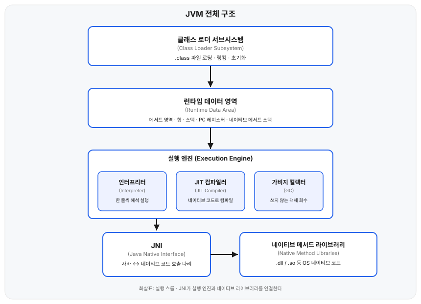
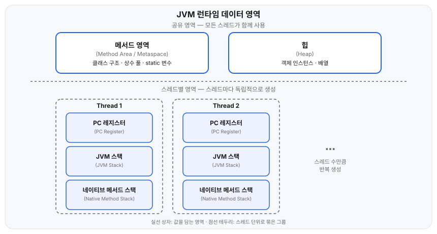
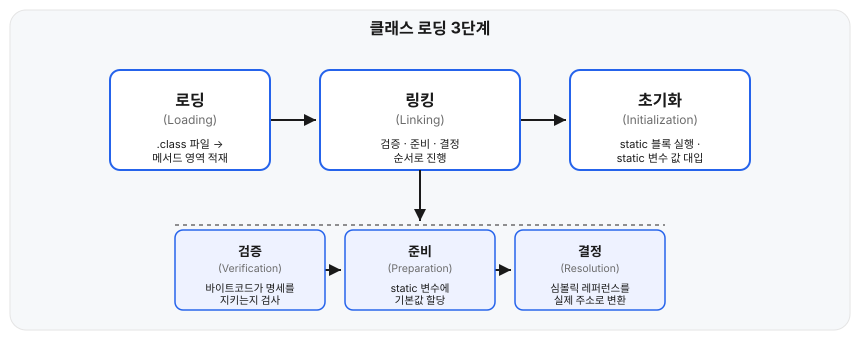

## 왜 필요한가

`.class` 파일이 실제로 실행되기까지, 그리고 실행 중 객체가 메모리 어디에 놓이는지 모르면 `OutOfMemoryError`를 마주쳤을 때 원인을 좁혀갈 방법이 없다. JVM은 클래스를 읽어 들이는 과정(클래스 로딩), 실행 중 데이터를 담아두는 영역(런타임 메모리 구조), 바이트코드를 실제로 실행하는 부분(실행 엔진)으로 나눠서 볼 수 있다.

## 용어 정리

- **JVM(Java Virtual Machine)**: 바이트코드를 실행하는 가상 머신 자체. 명세([JVM Specification](https://docs.oracle.com/javase/specs/jvms/se21/html/index.html))로 정의되고, HotSpot·OpenJ9처럼 구현체가 여러 개다.
- **JRE(Java Runtime Environment)**: JVM + 표준 라이브러리(`java.lang`, `java.util` 등). 실행만 할 때 필요하다.
- **JDK(Java Development Kit)**: JRE + 컴파일러(`javac`)와 개발 도구. Java 11부터는 JRE를 따로 배포하지 않고 JDK만 배포한다.

## 핵심 정리

JVM은 크게 클래스 로더 서브시스템, 런타임 데이터 영역, 실행 엔진 세 부분으로 이뤄진다. 실행 엔진은 필요하면 JNI를 거쳐 네이티브 메서드 라이브러리를 호출한다.



이 중 런타임 데이터 영역은 스레드 하나가 독점하는 영역과 모든 스레드가 공유하는 영역으로 나뉜다.



| 영역 | 공유 여부 | 담는 것 |
|---|---|---|
| 메서드 영역(Method Area) | 공유 | 클래스 구조, 상수 풀, static 변수, 메서드 바이트코드 |
| 힙(Heap) | 공유 | `new`로 생성한 객체 인스턴스, 배열 |
| JVM 스택(JVM Stack) | 스레드별 | 메서드 호출마다 쌓이는 프레임(지역 변수, 피연산자 스택, 리턴 주소) |
| PC 레지스터 | 스레드별 | 현재 실행 중인 바이트코드 명령의 주소 |
| 네이티브 메서드 스택 | 스레드별 | JNI로 호출한 네이티브(C/C++) 코드의 스택 |

이 구조는 [JVM Specification 2.5장](https://docs.oracle.com/javase/specs/jvms/se21/html/jvms-2.html#jvms-2.5)에서 정의한다. 구현마다 세부 이름은 다른데, HotSpot에서는 메서드 영역을 Java 8부터 **메타스페이스(Metaspace)**로 구현한다.

## 항목별 설명

**클래스 로딩은 세 단계로 진행된다.** 클래스가 처음 사용되는 시점에 JVM이 순서대로 처리한다.



| 단계 | 하는 일 |
|---|---|
| Loading | `.class` 파일을 읽어 바이트코드를 메서드 영역에 적재하고 `java.lang.Class` 객체를 힙에 생성한다 |
| Linking - Verification | 바이트코드가 JVM 명세를 지키는지 검증한다 |
| Linking - Preparation | static 변수에 타입별 기본값(0, `false`, `null`)을 할당하고 메모리를 확보한다 |
| Linking - Resolution | 심볼릭 레퍼런스를 실제 메모리 주소 레퍼런스로 바꾼다. 시점을 늦출 수 있어 지연 바인딩(lazy resolution)으로도 부른다 |
| Initialization | static 변수 초기화식과 static 블록을 소스 코드에 작성된 순서대로 실행한다(`<clinit>` 메서드) |

로딩은 세 개의 클래스 로더가 위임 모델(parent delegation)로 나눠 맡는다. 클래스 로더는 요청을 먼저 부모에게 넘기고, 부모가 못 찾을 때만 직접 로딩한다. 이 위임 구조와, `java.*` 패키지에 사용자 클래스로더가 클래스를 정의하지 못하게 막는 JVM의 보호 장치(`SecurityException: Prohibited package name`)가 함께 작동해, 애플리케이션 코드가 `java.lang.String`을 재정의해도 JVM은 항상 Bootstrap이 로딩한 원본을 쓴다.

| 클래스 로더 | 담당 |
|---|---|
| Bootstrap | `java.lang` 등 JDK 핵심 클래스 (네이티브로 구현, JVM에 내장) |
| Platform (구 Extension) | JDK 확장 모듈 |
| Application (System) | 클래스패스에 지정한 애플리케이션 클래스 |

**실행 엔진은 메서드 영역에 적재된 바이트코드를 실제로 실행한다.** 인터프리터와 JIT 컴파일러를 함께 쓰는데, 이 둘의 조합을 [JVM Specification](https://docs.oracle.com/javase/specs/jvms/se21/html/index.html)이 강제하지는 않는다. 아래는 HotSpot 기준이다.

| 구성 요소 | 하는 일 |
|---|---|
| 인터프리터(Interpreter) | 바이트코드를 한 줄씩 해석해 실행한다. 시작은 빠르지만 같은 코드를 반복 실행할 때 매번 다시 해석하므로 느리다 |
| JIT 컴파일러(Just-In-Time Compiler) | 자주 실행되는 코드(hot spot)를 찾아 네이티브 코드로 컴파일하고 캐싱한다. HotSpot이라는 JVM 이름이 여기서 나왔다 |
| 가비지 컬렉터(Garbage Collector) | 힙에서 더 이상 참조되지 않는 객체를 회수한다. 세대별 관리, Minor/Full GC 같은 동작 원리는 별도 글에서 다룬다 |

실행 엔진이 자바 코드가 아닌 네이티브(C/C++) 코드를 호출해야 할 때는 **JNI(Java Native Interface)**를 거친다. JNI로 호출된 코드는 OS별 네이티브 메서드 라이브러리(`.dll`, `.so` 등)에 들어 있고, 실행 중에는 [핵심 정리](#핵심-정리)에서 본 스레드별 네이티브 메서드 스택을 사용한다. `System.loadLibrary`로 네이티브 라이브러리를 불러오는 게 대표적인 사용 예다.

## 예시

static 초기화가 클래스 사용 시점에 일어난다는 걸 실행 순서로 확인할 수 있다.

```java
class Parent {
    static { System.out.println("Parent 초기화"); }
}

class Child extends Parent {
    static { System.out.println("Child 초기화"); }
}

public class Main {
    public static void main(String[] args) {
        System.out.println("main 시작");
        new Child();
    }
}
```

```text
main 시작
Parent 초기화
Child 초기화
```

`Child`를 초기화하려면 부모 클래스가 먼저 초기화돼 있어야 하므로, `Parent 초기화`가 항상 `Child 초기화`보다 먼저 출력된다. 두 초기화 모두 `new Child()`를 실행하는 순간, 즉 클래스를 실제로 사용하는 시점에 일어나고 `main 시작`보다 늦다.

## 혼동하기 쉬운 것

**스택과 힙의 구분.** 지역 변수와 메서드 호출 정보는 스레드별 JVM 스택에 쌓인다. `new`로 만든 객체 인스턴스는 힙에 있고, 스택의 지역 변수는 그 객체를 가리키는 레퍼런스만 들고 있다.

**PermGen과 메타스페이스.** Java 7까지 메서드 영역은 힙 안의 PermGen(Permanent Generation)으로 구현돼 있어 크기가 고정이었고, static 참조가 쌓이면 `OutOfMemoryError: PermGen space`가 났다. Java 8부터는 메타스페이스로 바뀌어 네이티브 메모리를 쓰고, 기본적으로 OS가 허용하는 한 자동으로 늘어난다.

## 참고

- [The Java Virtual Machine Specification, SE 21 — Chapter 2. The Structure of the Java Virtual Machine](https://docs.oracle.com/javase/specs/jvms/se21/html/jvms-2.html)
- [The Java Virtual Machine Specification, SE 21 — Chapter 5. Loading, Linking, and Initializing](https://docs.oracle.com/javase/specs/jvms/se21/html/jvms-5.html)
- [Oracle — Java Native Interface Specification](https://docs.oracle.com/en/java/javase/21/docs/specs/jni/index.html)
