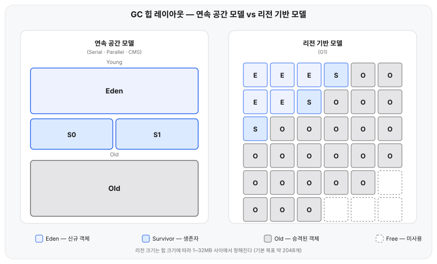

## 전제

[JVM 기본개념 — 클래스 로딩부터 메모리 구조, 실행 엔진까지](/posts/jvm-basics/)에서 실행 엔진의 구성 요소로 가비지 컬렉터를 다뤘지만 "힙에서 더 이상 참조되지 않는 객체를 회수한다"는 한 줄로만 남겨뒀다. 세대별 관리, Minor/Full GC 구분 같은 기본 개념은 그 글을 먼저 읽으면 된다. 여기서는 그 구분이 컬렉터마다 실제로 어떻게 다르게 일어나는지를 본다.

## 왜 필요한가

"Young 영역은 자주, Old 영역은 드물게, Full GC는 더 드물게" 정도의 설명으로는 답이 안 나오는 질문이 있다. 왜 어떤 컬렉터는 같은 메모리 압박 상황에서 Full GC를 겪고, 어떤 컬렉터는 겪지 않는가? "Full GC 빈도를 줄인다"는 튜닝 목표는 컬렉터마다 무슨 의미인가? 답하려면 컬렉터가 Young 영역을 비우는 방식과, Old 영역이 꽉 찼을 때 대응하는 방식을 봐야 한다.

## 구조

Serial·Parallel·CMS는 힙을 Eden·Survivor·Old로 나눈 연속된 공간으로 다룬다. JDK 9부터 기본 컬렉터인 G1은 힙을 동일 크기 리전(region)으로 쪼개고, 각 리전에 Eden·Survivor·Old 역할을 동적으로 부여한다.



## 동작 원리

**연속 공간 모델(Serial·Parallel).** Young GC(Minor GC)는 Eden과 사용 중인 Survivor 영역의 살아있는 객체를 복사(copying)해 비어있는 Survivor로 옮기고, Eden과 이전 Survivor를 통째로 비운다. 객체마다 살아남은 횟수(age)를 세다가 `-XX:MaxTenuringThreshold`(기본 15)를 넘기거나 Survivor 공간이 모자라면 Old로 승격(promotion)한다. Old 영역에 승격할 공간조차 없으면 — 로그의 `Allocation Failure`가 이 상황이다 — 힙 전체(Young + Old + 메타스페이스)를 훑어 회수하는 Full GC가 일어난다. Serial은 이 과정을 스레드 하나가, Parallel은 여러 스레드가 나눠 처리하지만 둘 다 Full GC 동안은 애플리케이션 스레드를 전부 멈춘다(stop-the-world).

**리전 기반 모델(G1).** Young GC는 Eden·Survivor 역할을 가진 리전만 비운다는 점은 같지만, 어떤 리전에 살아있는 객체가 많은지를 리전별 remembered set으로 미리 알고 있어 힙 전체를 훑지 않는다. Old 영역 점유율이 `-XX:InitiatingHeapOccupancyPercent`(기본 45%)를 넘으면 애플리케이션과 동시에 도는 동시 마킹 사이클(concurrent marking cycle)을 시작해 Old 리전 중 가비지가 많은 곳을 찾고, 이후 Young GC에 그 Old 리전 몇 개를 끼워 함께 회수하는 혼합 수집(mixed collection)을 한다. Old 회수 비용을 한 번의 긴 정지가 아니라 여러 번의 짧은 정지로 나누는 방식이다. 그런데도 회수 속도가 할당 속도를 못 따라가면 — 로그의 `Evacuation Failure`가 이 상황이다 — G1도 결국 단일 스레드 압축(compaction)으로 힙 전체를 정리하는 Full GC(`G1 Compaction Pause`)로 전환된다. G1의 설계 목표는 이 전환을 최대한 늦추는 것이지, 없애는 게 아니다.

## 직접 확인

JDK 26.0.1(HotSpot, Windows)에서 실측했다. 짧게 사는 객체와 오래 사는 객체를 섞어 만들어 Young GC와 Old 영역 압박을 동시에 유도하는 프로그램이다.

```java
import java.util.ArrayList;
import java.util.List;

public class GcDemo {
    public static void main(String[] args) {
        List<byte[]> longLived = new ArrayList<>();
        for (int i = 0; i < 300_000; i++) {
            byte[] garbage = new byte[1024];       // 대부분 곧바로 죽는다
            if (i % 8 == 0) {
                longLived.add(new byte[1024]);      // 8개 중 1개는 계속 참조를 들고 있는다
            }
        }
        System.out.println("longLived size = " + longLived.size());
    }
}
```

힙을 46MB로 고정하고(`-Xms46m -Xmx46m`) 컬렉터만 바꿔 실행했다.

```bash
java -Xms46m -Xmx46m -XX:+UseSerialGC   -Xlog:gc:file=serial.log   GcDemo
java -Xms46m -Xmx46m -XX:+UseParallelGC -Xlog:gc:file=parallel.log GcDemo
java -Xms46m -Xmx46m -XX:+UseG1GC       -Xlog:gc:file=g1.log       GcDemo
```

Serial 로그의 마지막 두 줄이다. Young GC로 더는 공간을 못 만들자 곧바로 Full GC가 뒤따른다.

```text
[0.073s][info][gc] GC(12) Pause Young (Allocation Failure) 33M->44M(44M) 4.299ms
[0.078s][info][gc] GC(13) Pause Full (Allocation Failure) 44M->33M(44M) 4.936ms
```

Parallel도 같은 패턴으로 끝난다.

```text
[0.081s][info][gc] GC(25) Pause Young (Allocation Failure) 32M->33M(41M) 1.960ms
[0.090s][info][gc] GC(26) Pause Full (Allocation Failure) 38M->34M(41M) 9.280ms
```

G1은 46MB에서는 Full GC 없이 끝났다. 대신 압박이 심해지는 지점에서 회수 실패(`Evacuation Failure`)와 동시 마킹 사이클이 나타난다.

```text
[0.075s][info][gc] GC(7) Pause Young (Normal) (G1 Evacuation Pause) (Evacuation Failure: Allocation) 36M->30M(46M) 1.922ms
[0.078s][info][gc] GC(8) Pause Young (Concurrent Start) (G1 Evacuation Pause) (Evacuation Failure: Allocation) 40M->40M(46M) 1.845ms
[0.078s][info][gc] GC(9) Concurrent Mark Cycle
[0.082s][info][gc] GC(9) Pause Remark 40M->40M(46M) 0.249ms
[0.083s][info][gc] GC(9) Pause Cleanup 40M->40M(46M) 0.034ms
```

세 컬렉터 모두 3회씩 반복 실행해 같은 경향이 재현되는 걸 확인했다.

## 성능

같은 46MB 힙, 같은 프로그램 기준 GC 발생 횟수다(3회 실행 모두 같은 경향).

| 컬렉터 | Young GC | Full GC | Full GC 직전 상태 |
|---|---|---|---|
| Serial | 13회 | 1회 | 44M→33M(44M), 4.936ms |
| Parallel | 26~28회 | 1회 | 38M→34M(41M), 9.280ms |
| G1 | 8~9회 | 0회 | — |

같은 메모리 압박에서 Serial·Parallel은 Full GC를 한 번씩 겪었지만 G1은 겪지 않았다. 힙을 42MB로 더 줄이면 G1도 결국 Full GC로 전환된다(3회 모두 재현).

```text
[0.084s][info][gc] GC(12) Pause Full (G1 Compaction Pause) 41M->36M(42M) 5.557ms
```

## 경계 조건

G1이 Full GC를 피하는 건 무한정이 아니다. 할당 속도가 동시 마킹·혼합 수집 속도를 넘어서면(위 42MB 사례처럼) G1도 결국 단일 스레드 압축 Full GC로 떨어진다. "G1을 쓰면 Full GC가 없다"가 아니라 "같은 압박에서 더 늦게, 더 드물게 겪는다"가 정확한 설명이다.

## 대안과 트레이드오프

G1의 동시 마킹은 애플리케이션 스레드와 CPU를 나눠 쓰므로 처리량(throughput) 관점에서는 순수 stop-the-world 컬렉터보다 오버헤드가 있다. 배치 작업처럼 지연시간보다 총 처리량이 중요하면 Parallel이 더 유리할 수 있다. 아주 큰 힙(수십 GB 이상)에서 정지 시간을 수 밀리초 이하로 눌러야 한다면 ZGC나 Shenandoah가 대안이다. 둘 다 리전 기반이라는 점은 G1과 같지만, 압축까지 대부분 동시에 처리해 정지 시간이 힙 크기에 거의 비례하지 않는다. 이 글에서는 실측하지 않았다.

## 언제 쓰고 언제 안 쓰나

- JDK 9 이상이면 별다른 이유가 없는 한 기본값인 G1을 그대로 쓴다.
- CPU 코어가 하나뿐이거나 힙이 아주 작은 환경(컨테이너 등)이라면 Serial이 오버헤드가 적다.
- 정지 시간보다 총 처리량이 중요한 배치·오프라인 작업이라면 Parallel을 검토한다.
- 큰 힙에서 정지 시간을 극단적으로 줄여야 한다면 ZGC·Shenandoah를 검토한다.

## 참고

- [Oracle — HotSpot Virtual Machine Garbage Collection Tuning Guide: The Garbage-First (G1) Garbage Collector](https://docs.oracle.com/en/java/javase/21/gctuning/garbage-first-g1-garbage-collector1.html)
- [OpenJDK — JEP 248: Make G1 the Default Garbage Collector](https://openjdk.org/jeps/248)
- [OpenJDK — JEP 377: ZGC: A Scalable Low-Latency Garbage Collector (Production)](https://openjdk.org/jeps/377)
- [OpenJDK — JEP 379: Shenandoah: A Low-Pause-Time Garbage Collector (Production)](https://openjdk.org/jeps/379)
